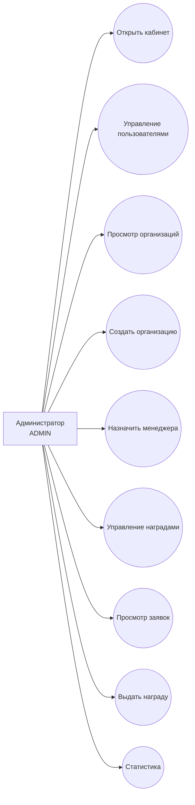

# Use Cases: Admin

## Сценарии

| ID | Use case | Endpoint | Результат |
| --- | --- | --- | --- |
| AD-01 | Открыть кабинет администратора | `/admin` | Админ видит стартовую страницу |
| AD-02 | Просмотреть организации | `GET /api/admin/organizations` | Получен список организаций |
| AD-03 | Создать организацию | `POST /api/admin/organizations` | Создана организация |
| AD-04 | Назначить менеджера | `POST /api/admin/organizations/{id}/managers` | Пользователь назначен менеджером |
| AD-05 | Создать награду | `POST /api/admin/rewards` | Создана награда |
| AD-06 | Просмотреть покупки наград | `GET /api/admin/rewards/purchases` | Получен список покупок |
| AD-07 | Просмотреть заявки на выдачу | `GET /api/admin/rewards/purchases/requested` | Получены заявки `REQUESTED` |
| AD-08 | Выдать награду | `POST /api/admin/rewards/purchases/{id}/issue` | Статус изменен на `ISSUED` |
| AD-09 | Управлять пользователями | `/admin/users` | Запланировано для развития |
| AD-10 | Смотреть статистику | `/admin/statistics` | Запланировано для развития |

## Проверки backend

- activeRole = `ADMIN`.
- Админ администрирует систему, но не участвует в мероприятиях как студент.
- При назначении менеджера backend добавляет роль `ORG_MANAGER`, если ее еще нет.
- Награду можно выдать только из статуса `REQUESTED`.
