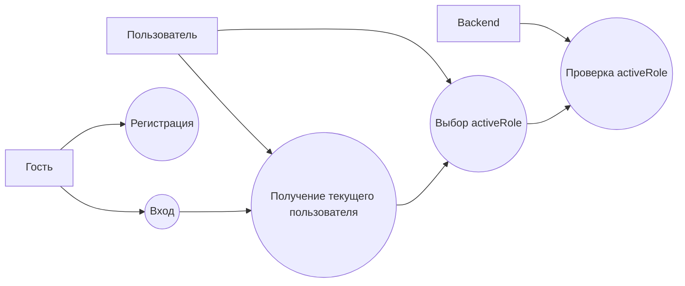

# Use Cases: Auth

## Сценарии

| ID | Use case | Актор | Результат |
| --- | --- | --- | --- |
| AUTH-01 | Регистрация | Гость | Создан пользователь с ролью `STUDENT` |
| AUTH-02 | Вход | Гость | Получен JWT и список ролей |
| AUTH-03 | Получение текущего пользователя | Пользователь | Получены профиль, роли и activeRole |
| AUTH-04 | Выбор activeRole | Пользователь | Выбран рабочий контекст |
| AUTH-05 | Проверка activeRole | Backend | Подтверждено, что роль есть у пользователя |

## Важное правило

`X-Active-Role` приходит с frontend, но backend обязан проверить, что эта роль действительно назначена текущему пользователю.
