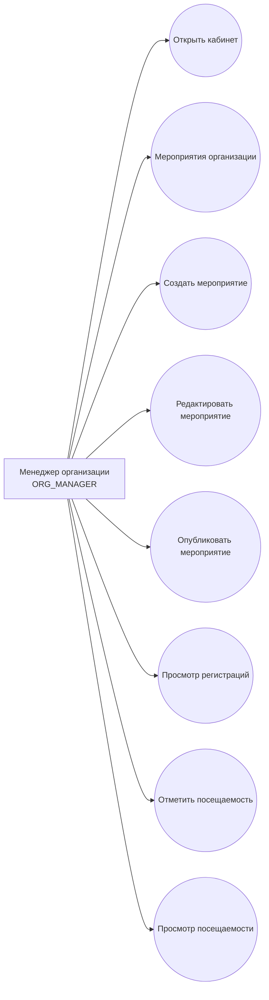

# Use Cases: Organization Manager

## Сценарии

| ID | Use case | Endpoint | Результат |
| --- | --- | --- | --- |
| MG-01 | Открыть кабинет менеджера | `/manager` | Менеджер видит стартовую страницу |
| MG-02 | Просмотреть мероприятия организации | `GET /api/manager/events/organization/{organizationId}` | Получен список мероприятий |
| MG-03 | Создать мероприятие | `POST /api/manager/events` | Создано мероприятие в статусе `DRAFT` |
| MG-04 | Опубликовать мероприятие | `POST /api/manager/events/{id}/publish` | Статус изменен на `PUBLISHED` |
| MG-05 | Просмотреть регистрации | `GET /api/manager/events/{id}/registrations` | Получен список студентов |
| MG-06 | Отметить посещаемость | `POST /api/manager/events/{id}/attendance` | Создана или обновлена отметка |
| MG-07 | Просмотреть посещаемость | `GET /api/manager/events/{id}/attendance` | Получен список отметок |

## Проверки backend

- activeRole = `ORG_MANAGER`.
- Менеджер может управлять только мероприятиями своей организации.
- Мероприятие можно публиковать только из статуса `DRAFT`.
- Посещаемость можно отметить только для зарегистрированного студента.
- Баллы начисляются только один раз за посещение мероприятия.
