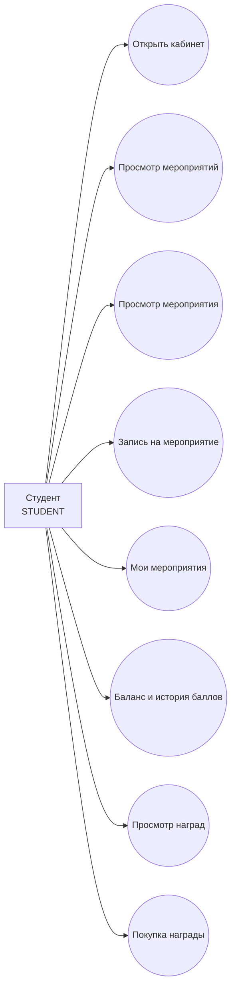

# Use Cases: Student

## Сценарии

| ID | Use case | Endpoint | Результат |
| --- | --- | --- | --- |
| ST-01 | Открыть кабинет студента | `/student` | Студент видит стартовую страницу |
| ST-02 | Просмотреть мероприятия | `GET /api/student/events` | Получен список опубликованных мероприятий |
| ST-03 | Просмотреть мероприятие | `GET /api/student/events/{id}` | Получена карточка мероприятия |
| ST-04 | Записаться на мероприятие | `POST /api/student/events/{id}/registrations` | Создана регистрация |
| ST-05 | Просмотреть мои мероприятия | `GET /api/student/my-events` | Получен список регистраций |
| ST-06 | Просмотреть баллы | `GET /api/student/points/balance`, `GET /api/student/points/transactions` | Получены баланс и история |
| ST-07 | Просмотреть награды | `GET /api/student/rewards` | Получен список активных наград |
| ST-08 | Купить награду | `POST /api/student/rewards/{id}/purchase` | Баллы списаны, создана заявка |

## Проверки backend

- activeRole = `STUDENT`.
- Студент действует только за себя.
- Запись возможна только на опубликованное мероприятие.
- Повторная запись на то же мероприятие запрещена.
- При покупке награды проверяются активность, остаток и баланс.
