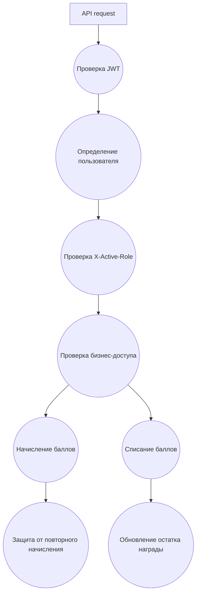

# Use Cases: System

## Системные сценарии

| ID | Use case | Когда выполняется | Результат |
| --- | --- | --- | --- |
| SYS-01 | Проверка JWT | Каждый защищенный запрос | Пользователь определен или запрос отклонен |
| SYS-02 | Проверка activeRole | Каждый role-based запрос | Подтверждено, что роль есть у пользователя |
| SYS-03 | Проверка бизнес-доступа | Действия менеджера, студента, админа | Запрещены чужие действия |
| SYS-04 | Начисление баллов | Менеджер отметил посещение | Создана положительная транзакция |
| SYS-05 | Защита от повторного начисления | При начислении за мероприятие | Повторные баллы не начислены |
| SYS-06 | Списание баллов | Студент покупает награду | Создана отрицательная транзакция |
| SYS-07 | Обновление остатка награды | После покупки награды | `stock` уменьшен на 1 |

## Правила безопасности

- JWT подтверждает личность пользователя.
- `X-Active-Role` подтверждает только желаемый контекст и всегда проверяется на backend.
- Студент может выполнять действия только за себя.
- Менеджер может работать только с мероприятиями своих организаций.
- Администратор управляет системой, организациями, пользователями и наградами.
